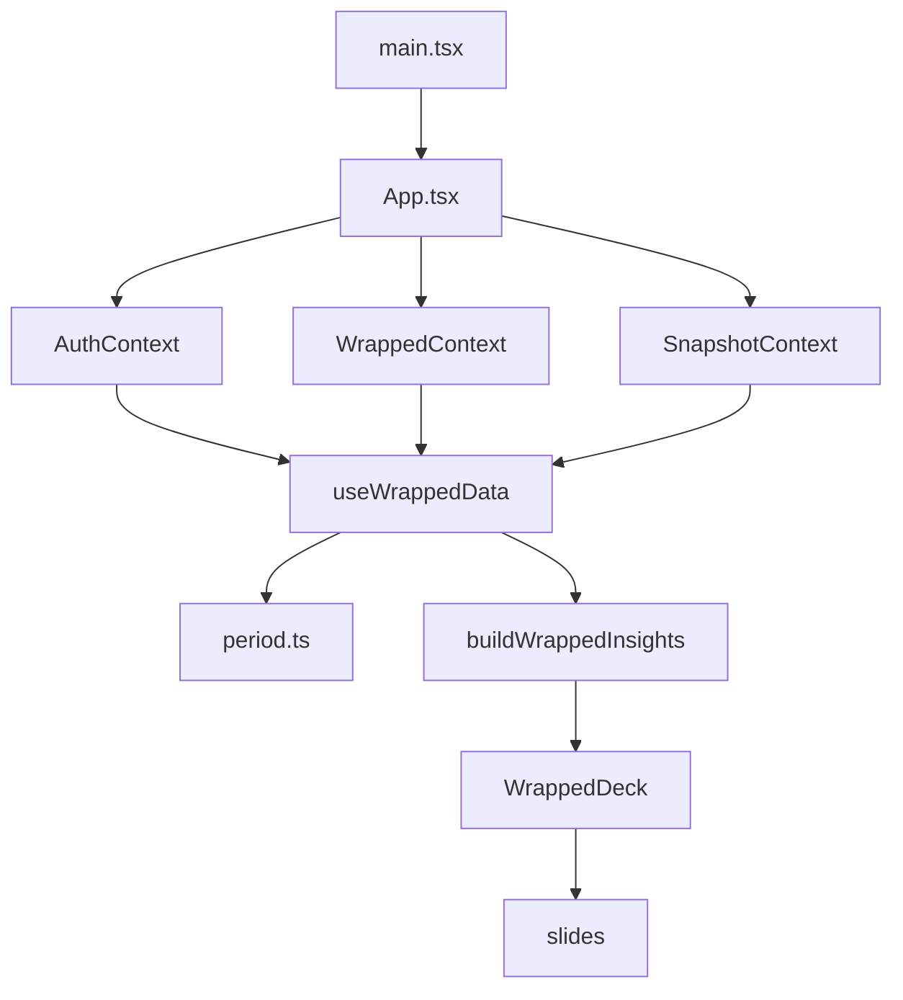

# Architecture

## Overview

`jutge-wrapped` is a small client-side React app with one main product flow:

1. authenticate with the Jutge API or load a local snapshot
2. choose a wrapped period
3. load raw data
4. derive `WrappedInsights`
5. render the slide deck

The codebase is approachable, but contributors should know that some responsibilities are currently concentrated in a few large files:

- `src/features/wrapped/WrappedDeck.tsx`
- `src/features/wrapped/selectors.ts`
- `src/api/jutgeClient.ts`
- `jutge_api_client.ts`

## Data flow

## Module boundaries

### App shell and providers

- `src/main.tsx` bootstraps i18n and early theme setup.
- `src/App.tsx` composes the provider tree and top-level shell.
- `src/context/AuthContext.tsx` owns the in-memory API session.
- `src/context/WrappedContext.tsx` stores the active wrapped period.
- `src/context/SnapshotContext.tsx` owns snapshot loading, auto-load, and cleanup.

Use this layer for app-wide state transitions, not for per-slide presentation logic.

### API and snapshot loading

- `src/api/client.ts` is the app-facing entry point for Jutge client helpers.
- `src/api/jutgeClient.ts` is the generated browser client.
- `jutge_api_client.ts` is the generated client used by `scripts/export-jutge-snapshot.mts`.
- `src/features/wrapped/useWrappedData.ts` decides whether data comes from the live API or a snapshot and produces the wrapped load state.
- `src/features/wrapped/snapshot.ts` hydrates and serializes snapshot payloads.

Use this layer for data access, loading state, and serialization boundaries.

### Domain model and calculations

- `src/features/wrapped/types.ts` defines `WrappedRawData`, `WrappedInsights`, and slide-facing domain types.
- `src/features/wrapped/period.ts` handles range validation, clipping, filtering, and aggregation.
- `src/features/wrapped/selectors.ts` turns raw API data into derived insights and translated narrative fragments.

Use this layer for business rules and derived stats. Prefer pure functions here when possible.

### Presentation

- `src/features/wrapped/WrappedDeck.tsx` orchestrates deck navigation, loading UX, and slide rendering.
- `src/features/wrapped/slides/*` are the slide-level UI units.
- `src/components/*` contains shared controls, charts, and layout helpers.

Use this layer for rendering. Keep calculations minimal and push reusable data shaping down into the domain layer.

### Localization and theming

- `src/i18n/*` initializes i18next and stores locale dictionaries.
- `src/theme/*` contains theme options and chart/color helpers.
- `src/index.css` defines the app tokens and theme-driven styles.

Use this layer for user-facing copy and presentation tokens, not for wrapped business logic.

## Where a change should go

- New slide layout or animation: `src/features/wrapped/slides/*`
- New wrapped metric, ranking rule, or insight field: `src/features/wrapped/selectors.ts`
- New period semantics or date filtering behavior: `src/features/wrapped/period.ts`
- Live-data vs snapshot loading behavior: `src/features/wrapped/useWrappedData.ts` or `src/context/SnapshotContext.tsx`
- Shared UI controls or charts: `src/components/*`
- Global shell, provider, or session behavior: `src/App.tsx` and `src/context/*`
- New text or copy adjustments: `src/i18n/locales/*.json`

## Current architecture debt

These are known friction points, not conventions to copy:

- `WrappedDeck.tsx` mixes navigation, loading states, gesture handling, slide rendering, and share-image precomputation.
- `selectors.ts` mixes pure calculations with translation-driven narrative copy.
- Some shared chart components depend directly on wrapped feature types, which makes the boundary between `components` and `features/wrapped` less clear than it should be.
- The project keeps two generated API clients for different runtimes, which increases maintenance cost and contributor confusion.

## Recommended incremental refactors

These are safe refactors to prefer over large folder reshuffles:

1. Extract deck behavior into focused hooks such as `useDeckNavigation` and `useSlideSharePrecompute`.
2. Split `selectors.ts` into smaller insight modules such as `heatmap.ts`, `weekday.ts`, `chrono.ts`, and `ranking.ts`.
3. Keep translated narrative generation separate from pure calculations so tests can stay lightweight.
4. Move wrapped-specific types out of generic chart components if those components need to become truly reusable.
5. Consolidate the two generated API clients behind a single source or an explicit sync workflow when practical.

## Contribution rule of thumb

Favor small, boundary-respecting changes:

- add docs when you introduce a new architectural concept
- keep slide files presentational
- keep domain rules close to `period.ts` and `selectors.ts`
- keep generated files isolated and avoid casual manual edits
- update `en`, `es`, and `ca` together whenever the UI copy changes
